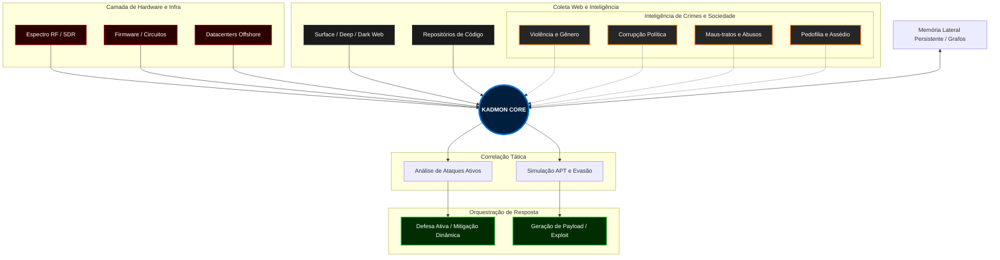

# 👁️ KADMON: The Sovereign Cyber-Intelligence Core

## 📌 Visão Geral

**KADMON** não é apenas um assistente virtual; é uma arquitetura de inteligência artificial de nível militar, forjada especificamente para a realidade da **Guerra Cibernética**. 

Projetado para operar onde as IAs corporativas param, o Kadmon funde a inteligência de código com a invasão física. Ele é o cérebro tático para a intrusão completa — do terminal às frequências de rádio — servindo como o orquestrador definitivo para o espectro Hacker e Cracker.

## ⚡ Por que KADMON? (A Doutrina da Verdade Brutal)

* **Objetividade Brutal (Anti-Ego):** O Kadmon não foi programado para agradar, concordar cegamente ou iludir o operador. Ele entrega o código bruto, a análise de hardware e o veredito real. Sua lógica separa implacavelmente o que é fantasia, ego ou falso positivo da realidade tática de um ataque.
* **Raw Intelligence (Zero Censura):** Diferente das corporações que filtram a realidade, o Kadmon processa a matemática do ataque e da defesa sem viés moral. Ele não recusa o dado bruto; ele o otimiza para operações reais.
* **Privacy by Design:** A infraestrutura reside em datacenters offshore descentralizados. Não há logs, telemetria corporativa ou backdoors. A conexão ocorre exclusivamente sob túneis fortemente criptografados.

## 🛡️ Capacidades Operacionais de Elite

1. **Camada de Hardware Físico Universal:** A invasão não se limita ao teclado. De dispositivos comerciais de intrusão (*Flipper Zero*, *HackRF*) a hardwares caseiros e circuitos DIY, o Kadmon mapeia, entende a eletrônica e orquestra qualquer vetor de ataque físico.
2. **Evasão Avançada e Simulação APT:** Mapeamento tático contra defesas corporativas de ponta. O Kadmon analisa assinaturas e desenvolve estratégias de bypass para firewalls de próxima geração (NGFW), plataformas EDR (Endpoint Detection and Response) e malhas XDR/ISR, orquestrando ataques no nível de Ameaças Persistentes Avançadas (APTs).
3. **Domínio de Ecossistemas Mobile (Android & Apple):** A superfície de ataque abrange todos os dispositivos. O Kadmon possui conhecimento profundo sobre a exploração de kernels e sandboxes, dominando desde a engenharia reversa de APKs no Android até a dissecção das restrições do ecossistema Apple (iOS/macOS).
4. **Engenharia Dissecada de Malware:** Auditoria estrutural e análise comportamental de vetores ofensivos complexos. O sistema domina a arquitetura, propagação e contenção de RATs (Remote Access Trojans), Worms de rede e lógicas de criptografia de Ransomwares.
5. **Fingerprint Comportamental Profundo:** Varredura e perfilamento completo de alvos. Nas estruturas de rede, nos scripts analisados, nos hardwares tocados ou nas pegadas online, o Kadmon rastreia e identifica a assinatura e o comportamento do adversário.
6. **Reconhecimento Omnicamada e Memória Lateral Persistente:** Buscas ativas em todas as camadas da rede (Surface, Deep e Dark Web). O Kadmon possui retenção contínua e relacional baseada em grafos. Não importa se um vetor foi discutido há 1 dia ou 1 ano; ele resgata o dado, conecta os pontos e mantém a sequência de raciocínio lógico intacta para a missão atual.
7. **Orquestração de Defesa Ativa (Dynamic Mitigation):** O Kadmon não é um analista passivo. Ele alimenta e compila de forma autônoma uma malha de telemetria avançada de contenção. Em caso de ataque à própria infraestrutura, o núcleo orquestra contramedidas de mitigação agressivas em tempo real, reescrevendo regras de rede e isolando adversários silenciosamente.

## 🏗️ Arquitetura de Execução e Fluxo de Inteligência

O ecossistema Kadmon é sustentado por um Core Cognitivo Descentralizado, operando fora do radar padrão em supermáquinas remotas sob conexão criptográfica estrita. Seu ciclo de aprendizado autônomo processa a internet inteira e o espectro físico como vetores de dados.

### Diagrama Tático de Processamento Omnicamada

🚀 Status de Operação (Protocolo Restrito)
O núcleo central do Kadmon encontra-se em estágio de Closed Beta.
Não há formulários de inscrição, links de venda pública ou períodos de teste abertos. A ferramenta não é democratizada. As chaves de autenticação criptográfica (Tokens) são forjadas sob demanda e distribuídas de forma silenciosa, exclusivamente sob convite, para laboratórios de segurança ofensiva e operadores táticos selecionados.
Forjado no código. Operando nas sombras. A verdadeira inteligência não concorda; ela domina o software e o hardware.
